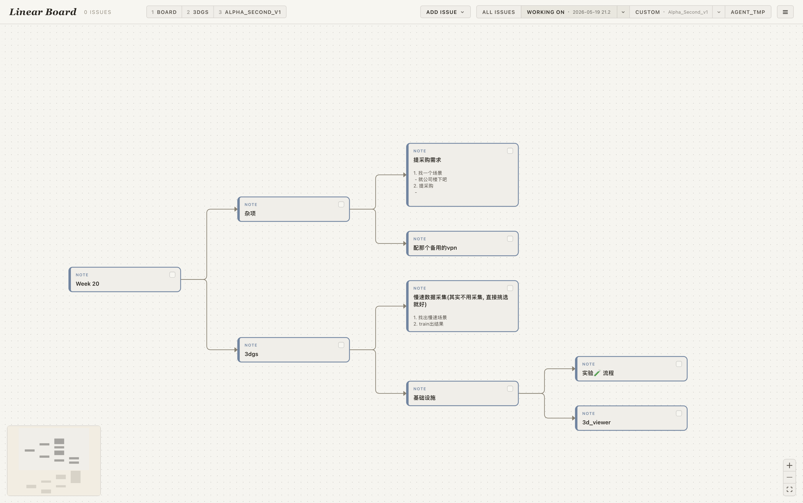

# Linear Board View

> 单用户、本地跑的 Linear issue 自由摆位画布。原生 macOS app（Tauri），把一个 Linear workspace 的 open issues 平铺在可缩放可平移的暖色画布上；拖动只改空间位置，字段编辑走卡片上的 inline 控件，乐观提交后写回 Linear。Issue 卡之外也支持纯 note 卡（含粘贴图片）作为思维笔记 / TODO，note 与 issue 之间手动连线，整张 board 是一棵自由生长的 mindmap。



设计取向：**一眼看清全局 + 流畅愉悦的编辑**，而不是 Linear 原生那种列表+表格。详细范围与非目标见 [`PROJECT_STATEMENT.md`](./PROJECT_STATEMENT.md)。

---

## 安装

只跑 macOS。没有 web 版（v0.26.0 起已下线浏览器 runtime）。

### 用户向（推荐）

GitHub Releases 里下最新的 `Linear Board_<version>_aarch64.dmg`，装到 `~/Applications/Linear Board.app`。app 自带 in-app updater，TopBar → ☰ → Check for updates 即可一键升级。

### 源码 build

```bash
# 1. 依赖（Rust toolchain + Node ≥ 20 + Xcode CLT）
npm install

# 2. 开发：起 Tauri 窗口 + vite + Rust 后端（热重载）
npm run tauri:dev

# 3. 装 prod 到 ~/Applications/Linear Board.app
npm run release
```

API key 走以下两种之一（Rust 端 `resolve_api_key` 顺序读取）：

1. 环境变量 `LINEAR_API_KEY=lin_api_xxx`
2. 文件 `~/Library/Application Support/com.han.linearboard/data/linear_api_key.txt`，单行写 token

没有 key 也能跑——读现有快照浏览没问题；TopBar → ☰ → Refetch 和所有 inline 编辑会失败弹 toast。

---

## 视图

顶栏左边是钉住的 Custom view chip 条；右边四个 mode 之间互斥切换：

| Mode | 单键 | 内容 |
| --- | --- | --- |
| **ALL ISSUES** | `S` | 所有 open issue（backlog / unstarted / started）一张大 board |
| **WORKING ON** | `D` | 按天建的工作 board，启动默认开最新一张；点 `WORKING ON 05/15 ▾` 弹下拉切换 / 删除 |
| **CUSTOM** | — | 任意命名的 board（如 "Q2 launch"），下拉里右键 Pin 把它钉到左侧 chip 条 |
| **AGENT_TMP** | `A` | 占位，待 Rust pty 落地接回 |

Chip 条的 1-9 对应顺序，单键直达；chip 可拖动改顺序。

每个 board 是独立的成员集合 + 位置 + 笔记 + edges。同一份 OS 剪贴板 buffer 跨 board，`⌘C` / `⌘V` 整组复制粘贴。

---

## 主要交互

### Issue 卡（来自 Linear）

- **顶栏 Refetch**（☰ 菜单）从 Linear GraphQL API 拉一份新快照写到本地 `issues.json`。只保留 open 状态（backlog / unstarted / started）。
- **拖动**：改 canvas 上的位置（持久化在每个 board 自己的 json）。
- **点击**：右侧弹 DetailPanel，可 inline 改 title / description / status / priority / assignee / labels / project / cycle / comment，乐观提交，失败回滚并 toast。
- **过滤器**：顶栏 FilterBar 按 status / priority / assignee / project / cycle / label 临时隐藏。

### Note 卡（本地）

- 双击空白画布建一张 note；第一行视觉上加粗当标题，下面是正文，本质是同一段文本（一个 textarea）。
- 三态 todo 复选框：未做 → working on（蓝描边内辉光）→ done（划线 + 灰）。
- 选中卡片右上浮出 8 色调色板换 frame 色；新生成的子 note 默认继承父色。
- **粘贴图片**：选中某张 note 时 `⌘V` 贴进它，否则在视口中心新建一张抱图 note。图片可拖四角缩放，shift 锁比例，× 删图。同一张 note 内文本和图片可交替。只有图片没文字的 note 不显示顶部 NOTE 标识，相当于纯图卡。

### Mindmap 连线

- **`C`**：进入 connect 模式 → 两两配对点卡片连线（a→b, c→d, …），点空白 / Esc / 再按 `C` 退出。线是本地视觉关系，不写回 Linear。
- **`Tab`**：在选中卡上一键生成右侧子 note，自动连线。
- **`⇧Tab`**：生成兄弟 note（同父，紧贴当前选中卡下方）。
- **`F`**：tidy 当前焦点的局部子树 —— 焦点卡不动，descendants 用 slot-based 布局展开到右侧。
- **`⇧F`**：tidy 整张 canvas 的每棵根子树，按当前 Y 顺序垂直堆叠。
- **拖卡到另一张卡上**：reparent —— 旧 edge 自动断、新 edge 连过去，整组拖动支持改嫁同一 target，目标卡发出暖色光晕；落到自己 descendant 是 cycle，只移位置不 reparent。

### Group（移动作用域）

- 选 ≥2 张卡按 `G` 成组：整组同移，但 edit / DetailPanel / edge 各自独立；对整组再按 `G` 解散。

### 其他

- `↑↓←→`：在卡片间空间最近邻跳焦点（±45° cone），新焦点自动 pan 到 viewport 25%–75% 舒适区。
- `Space`：note 进入 inline 编辑；issue 打开 DetailPanel；没焦点时落到视觉中心最近的卡。
- `U` / `⇧U`：undo / redo，最多 50 步。
- `?`：弹完整快捷键速查表。

---

## 数据存储

prod app 写到 `~/Library/Application Support/com.han.linearboard/data/`；dev release（`npm run release:dev <suffix>`）写到 `…/com.han.linearboard.dev.<slug>/data/`，两套物理隔离。

```
data/
├── issues.json                # Linear snapshot：issues + meta.workflowStates
├── all_issues_board.json      # All Issues 视图的位置/notes/edges
├── working_on/
│   ├── views.json             # day-view 清单
│   └── wov_<id>.json          # 每张 day board
├── custom/
│   ├── views.json             # custom-view 清单 + chip pin 顺序
│   └── cv_<id>.json           # 每张 custom board
└── linear_api_key.txt         # 可选，单行 lin_api_xxx
```

**iCloud 备份**：每天 00:00 / 12:00 / 15:00 / 18:00 / 21:00 自动把整个 data 目录拷到 `~/Library/Mobile Documents/com~apple~CloudDocs/LinearBoardBackup/<时间戳>/`，保留最近 30 天。iCloud Drive 没开就静默跳过。

---

## 架构

详细见 [`CLAUDE.md`](./CLAUDE.md)。一句话：

- **Runtime**：单 Tauri runtime（Tauri 2.x）。前端 vite + React 18 + `@xyflow/react`；后端 Rust 用 `reqwest` 手写 GraphQL client 直连 Linear API。
- **Snapshot 即真理**：Rust 把 Linear API 结果序列化成 `IssueRecord[]` 写到 `issues.json`，前端通过 `invoke("read_issues_snapshot")` 读，全部内存中操作。
- **乐观编辑**：`App.mutate(id, patch)` 是 issue 字段写回的唯一路径——本地立刻应用、`invoke("linear_update_issue")`、收到响应后用服务端权威记录替换；失败回滚到 `prevIssue` 并 toast。
- **IPC 表面**：前端不直接 `invoke`，所有调用走 `src/lib/tauriInvoke.ts` 的 typed wrapper；新增 endpoint = Rust 写 `#[tauri::command]` 注册到 `src-tauri/src/lib.rs::invoke_handler` + 在 wrapper 文件加一个函数。
- **In-app updater**：`tauri-plugin-updater` 拉 GitHub Releases 的 latest.json，安装时 `tauri-plugin-process::relaunch()` 自动重启。

### 关键文件

```
src/
├── App.tsx                    # 顶层 state（snapshot / 当前 view / DetailPanel）
├── components/
│   ├── CanvasBoard.tsx        # ReactFlow 包装 + 全局键位 + 选区 / 连线 / 组 / 复制粘贴 / drag-reparent
│   ├── IssueCard.tsx          # Linear issue 卡
│   ├── NoteCard.tsx           # 本地 note 卡 + 图片渲染缩放
│   ├── DetailPanel.tsx        # 右侧 inline 编辑面板
│   ├── TopBar.tsx             # 顶栏（视图切换 + chip 条 + Add Issue + 菜单）
│   ├── PinnedTabsStrip.tsx    # 顶栏左侧的 custom-view chip 条 + 拖排序
│   ├── WorkingOnDropdown.tsx  # WORKING ON / CUSTOM 的下拉
│   ├── FilterBar.tsx          # status / priority / … 过滤
│   ├── IssuePickerPopover.tsx # 把 issue 拽进当前 board 的搜索 picker
│   ├── UpdaterModal.tsx       # in-app updater 弹窗
│   └── ShortcutsDialog.tsx    # `?` 速查表
├── lib/
│   ├── tauriInvoke.ts         # Rust 命令的 typed wrapper（唯一 IPC 入口）
│   ├── useBoardState.ts       # 每个 board 的数据持久化 + undo/redo
│   ├── useWorkingOnViews.ts   # day-view / custom-view manifest 管理
│   ├── usePinnedTabs.ts       # custom chip 钉选 + 拖排序
│   ├── mindmapLayout.ts       # F tidy 的 slot-based 布局
│   ├── workingOn.ts           # NoteNode / NoteImage / GroupBox 数据形
│   ├── clipboard.ts           # ⌘C/⌘V 编解码（linear-board-cards:<base64> envelope）
│   ├── filter.ts              # 顶栏过滤逻辑
│   ├── updater.ts             # tauri-plugin-updater 的薄包装
│   └── synthetic.ts           # ?perf=1 时把 issue 复刻到 200 张
├── linear/
│   ├── types.ts               # IssueRecord / CommentRecord / WorkflowState …
│   ├── updateIssue.ts         # IssuePatch 类型
│   └── fetchWorkflowStates.ts # workflow state 类型
└── main.tsx
src-tauri/
└── src/
    ├── lib.rs                 # Tauri commands（snapshot R/W、视图 R/W、API key、备份）
    ├── linear.rs              # GraphQL client：fetch_all_issues / fetch_workflow_states / update_issue / create_issue_comment
    └── backup.rs              # iCloud Drive 定时备份调度
```

---

## 版本

[Pride versioning](./CLAUDE.md#pride-versioning)：`x.y.z` 中 `x = proud`、`y = 新功能`、`z = shame`。每个版本一行简介在 [`VERSION_LOG.md`](./VERSION_LOG.md)。当前版本见 `package.json#version` 与 `~/Applications/Linear Board.app` 的 About 信息。

## License

私有项目，无 license。
